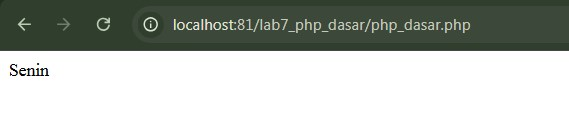

# Lab7Web (Praktikum 7)

## Belajar Dasar PHP
Memanggil Hello World dengan kode seperti berikut :

## Menambahkan Variable
Menambahkan variable pada program dengan kode seperti berikut :

## Predefine Variable
Menggunakan predefine variable $_GET yang sudah didefinisikan oleh PHP dengan kode seperti berikut :
http://localhost:port/lab7_php_dasar/php_dasar.php?nama=Farel (Masukkan nama pada URL masing - masing)

## Membuat Form Input
Membuat form input pada PHP dan memanggil output dengan $_POST dengan kode seperti berikut :

## Operator
Menggunakan operator pada PHP dengan kode seperti berikut :

## Kondisi IF
Menggunakan IF pada PHP dengan kode seperti berikut :

## Kondisi Switch
Menggunakan Switch pada PHP dengan kode seperti berikut :

## Perulangan FOR
Menggunakan FOR pada PHP dengan kode seperti berikut :

## Perulangan WHILE
Menggunakan WHILE pada PHP dengan kode seperti berikut :

## Perulangan DO WHILE
Menggunakan DO WHILE pada PHP dengan kode seperti berikut :

### Tugas Praktikum
Membuat Form Input dengan ketentuan seperti berikut :
> Buatlah program PHP sederhana dengan menggunakan form input yang menampilkan
> nama, tanggal lahir dan pekerjaan. Kemudian tampilkan outputnya dengan menghitung
> umur berdasarkan inputan tanggal lahir. Dan pilihan pekerjaan dengan gaji yang
> berbeda-beda sesuai pilihan pekerjaan.

Berikut Kode dari sebuah program PHP yang dapat menyelesaikan tugas diatas beserta Output nya :

